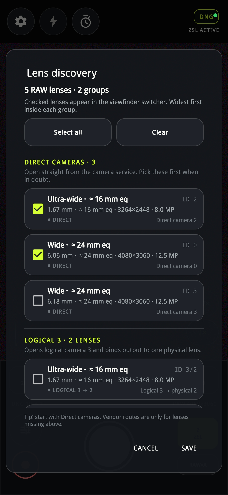
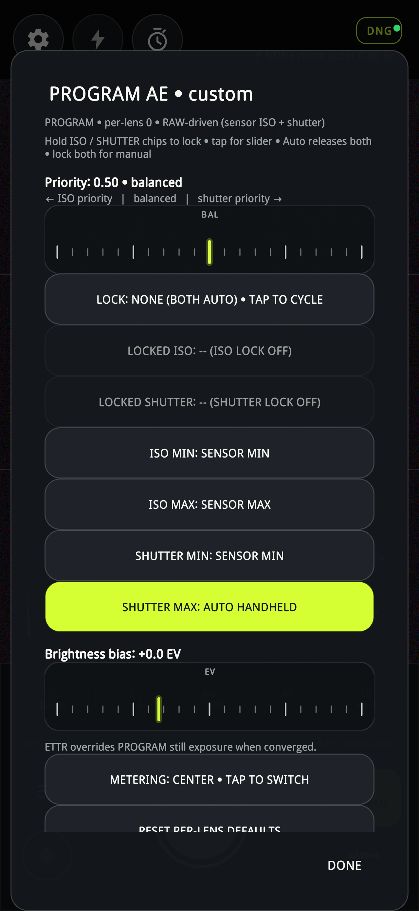
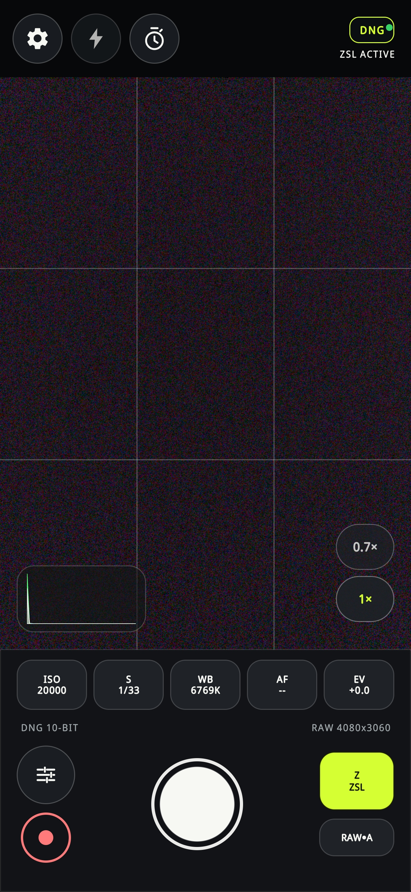

# RawLens — User Guide (dishwasher-manual style)

> **Easiest PDF:** open `user-guide.html` in Chrome/Edge/Safari → `Ctrl/Cmd+P` →
> Destination `Save as PDF` → Background graphics ON → Save.
> Alternative: `pandoc user-guide.md -o RawLens-Manual.pdf`
> (or `weasyprint user-guide.html RawLens-Manual.pdf`).

## 0. Screenshot map — your 15 images

Save chat images into `docs/user-guide/images/` with these exact names,
then re-open the HTML and they appear inline:

| # | Save as | Shows | Chapter |
|---|---------|-------|---------|
| Image 1 | `images/screenshot-01-lens-discovery.png` | Lens discovery: 5 RAW lenses, DIRECT 3, LOGICAL 3 | Ch.7 |
| Image 2 | `images/screenshot-02-jpeg-adaptive.png` | Settings JPEG lower: hue/highlight/shadow/adaptive | Ch.8 |
| Image 3 | `images/screenshot-03-exposure.png` | Settings Exposure + ETTR | Ch.9 |
| Image 4 | `images/screenshot-04-jpeg-output.png` | Settings JPEG upper: UltraHDR/P3/chroma/quality/AgX | Ch.8 |
| Image 5–9 | `images/screenshot-05 … 09.png` | **Arrived corrupted (white + CMY streaks). Re-export.** | slots kept |
| Image 10 | `images/screenshot-10-program-ae.png` | PROGRAM AE custom panel | Ch.6 |
| Image 11 | `images/screenshot-11-manual-slider.png` | Viewfinder + S 1/14 ruler, LIMITS/AUTO | Ch.5 |
| Image 12 | `images/screenshot-12-zsl.png` | Viewfinder ZSL ACTIVE, 0.7×/1× | Ch.1 |
| Image 13 | `images/screenshot-13-auto.png` | Viewfinder AUTO AE | Ch.1 |
| Image 14–15 | `images/screenshot-14 … 15.png` | Spare: General tab, Burst tab | Ch.10 |

## 1. Viewfinder at a glance (Images 11–13)

Top = selectors, middle = window, bottom = chips + shutter.

1. **Top-left ⚙ ⚡ ⏱** — Settings / torch / 2s-5s timer. White = on.
2. **Top-right DNG● + sub-line** — status lamp. `AUTO AE`, `P NONE (both auto)`,
   `ZSL ACTIVE / ZSL … / ZSL OFF / ZSL N/A`, `HDR ±2 EV`.
3. **Middle window** — tap = AF, drag = AE target. Grid = thirds.
   Dark/grainy shots at ISO 20000 are a dark room, not a bug.
4. **Scope (histogram / waveform)** — left shadows, right highlights. Tap toggles the graph; the SCOPE tile toggles on/off on tap and switches graphs on long-press. Data is linear RAW with DNG, AgX JPEG preview with a JPEG format (auto).
5. **Lens pills `0.7× / 1×`** — lime = active. Only checked lenses appear.
6. **Chips ISO/S/WB/AF/EV** — tap = slider, hold = lock (PROGRAM).
7. **White shutter** = photo. Red = video. Sliders icon = quick panel.
8. **Mode `A/P/Z/M` + `RAW•A`** — tap mode to cycle.

First-light: check only DIRECT lenses → SAVE → one daylight AUTO shot →
check `DCIM/RawLens/<stem>.dng + .jpg`.

## 2. Chips in detail

| Chip | AUTO/ZSL | PROGRAM | MANUAL |
|------|----------|---------|--------|
| ISO | readout | tap slider, hold lock | direct |
| S | readout, handheld-capped | tap slider, hold lock, AUTO HANDHELD floor | direct 1/10000–1/2 |
| WB 6769K | auto Kelvin, JPEG only | same | same |
| AF -- | tap/drag focus | same | same |
| EV +0.0 | compensation | brightness bias, disabled in M | disabled |

Line below: `DNG 10-BIT   RAW 4080×3060` = bit depth + active RAW size
(8 MP 3264×2448 on 0.7×, 12.5 MP 4080×3060 on 1×).

## 2B. ★ Capture format DNG ↔ JPEG ↔ JPEG+DNG — how to switch

**Short answer: tap the top-right `DNG / JPEG / JPEG+DNG` pill.**
Each tap cycles one step. No Settings menu needed.

Two different switches — do not mix them:

- **A. Top-right pill = FILE format (what lands in `DCIM/RawLens`).**
  Tap to cycle `DNG ONLY → JPEG → JPEG+DNG → DNG ONLY …`.
  Toast confirms `DNG ONLY / JPG / JPG+DNG`. Green dot = RAW will save.
  Persisted across restarts. Locked while saving (`LOCKED • SAVING`).
- **B. Bottom-right `RAW•A / JPG•A / RAW / JPG` = PREVIEW only.**
  Tap to cycle `FOLLOW (RAW•A) → RAW → JPG → FOLLOW …`.
  `RAW•A` = auto-follow the file format. Changes screen only, not files.

| You want… | Tap A until… | Files per press | When |
|---|---|---|---|
| Max latitude | `DNG` | 1× .DNG | Default, grading |
| Share instantly | `JPEG` | 1× .JPG (AgX from RAW) | Messaging, small files |
| Both | `JPEG + DNG` | 1× .DNG + 1× .JPG | Master + share copy |

Try: tap pill → `JPG` → shoot → only .jpg. Tap twice → `JPG+DNG` →
both. Tap once more → back to `DNG ONLY`.
If tap does nothing: you hit `RAW•A` (preview) not the top pill,
or a save is in flight — wait and tap top-right again.
ZSL note: JPEG modes bounded to 6 frames; DNG-only up to 30.

## 3. Ruler panel (Image 11: S 1/14 + LIMITS + AUTO)

- Ruler = drag shutter scale, green tick = current.
- `LIMITS` (dark) = per-lens min/max editor.
- `AUTO` (lime) = release this axis to auto.
- Top `P NONE (both auto) 0.50 Br…` = PROGRAM mirror.

Hold vs tap (PROGRAM): tap = slider, hold = lock, hold second = MANUAL.

## 4. PROGRAM AE custom (Image 10)

Header: `PROGRAM • per-lens • RAW-driven (sensor ISO + shutter)`.

- **Priority 0.50 balanced** — 0.00 ISO priority (sharp, noisy) ↔ 1.00 shutter
  priority (clean, blur risk). Damped ~1 stop/s.
- **LOCK NONE (BOTH AUTO)** — tap cycles NONE → ISO_LOCK → SHUTTER_LOCK.
- **LOCKED ISO/SHUTTER --** — frozen value or -- = off.
- **ISO/SHUTTER MIN/MAX** — tap cycles bounds. `SHUTTER MAX: AUTO HANDHELD`
  (lime = editing) = shake-safe floor.
- **Brightness bias +0.0 EV** — trim around target.
- **METERING CENTER** — tap: CENTER → AVERAGE → SPOT (RAW metering).
- **RESET PER-LENS DEFAULTS + DONE** — per-lens save.

ETTR converged freezes PROGRAM and owns exposure.

## 5. Lens discovery (Image 1)

Checked = viewfinder pill, widest first per group.

- `5 RAW lenses • 2 groups`, `Select all / Clear`.
- `DIRECT CAMERAS • 3 — Pick these first.` e.g. Ultra-wide 16 mm ID 2 ☑
  (1.67 mm, 3264×2448, 8 MP), Wide 24 mm ID 0 ☑ (6.06 mm, 4080×3060,
  12.5 MP). Leave duplicate Wide ID 3 ☐ unchecked.
- `LOGICAL 3 • 2 LENSES` e.g. ID 3/2 ☐ — only for missing lenses.
- `SAVE` persists, empty rejected with `PICK A RAW LENS`.

Recommended: check ID 2 + ID 0 only → `0.7× / 1×`.

## 6. Settings JPEG (Images 2 + 4)

JPEGs are always developed from paired RAW.

Top: Ultra HDR gainmap (Android 14+) ☐, Display P3 ☐,
chroma `4:2:2` (tap cycles), quality `100%` (92–95% = same look, smaller),
AgX purity/contrast/saturation `100%`.

Bottom: Preserve hue `0%`, Highlight `+6.5 EV`, Shadow `10.0 EV`,
Gamut `0%`, Adaptive (AUTO/ZSL) ☑, PROGRAM adaptive `50%`,
headroom `1.00`, sky `0.85`, shoulder `100%`, Reset official AgX Base.

Helper: headroom caps p99.5 spike, sky caps p95, shoulder rolls into AgX.

## 7. Settings Exposure (Image 3)

Badge `HDR ±2 EV` = HDR on.

Lock NONE, Metering CENTER, ISO min/max SENSOR MIN/MAX,
Shutter min SENSOR MIN / max AUTO HANDHELD, Brightness `+0.0 EV`,
ETTR ☐ (`Expose-To-The-Right`, RAW-measured; keeps shutter cap, accepts
darker frame vs noise/blur), headroom `-0.3 EV`, ISO ceiling SENSOR MAX.

HDR block (same scroll): save 3 brackets vs merged single DNG,
range ±2 vs ±4 EV. Debug frames under Debug tab.

## 8. General / Burst / Denoise / Debug

- **General:** DNG backend, GPS, viewfinder resolution/mode, per-ID DNG
  calibration (black/white, noise, matrices; Reset = defaults).
- **Burst/ZSL:** master checkbox (= Z button), frames 1–30 (default 2),
  30 fps ≈ 1 s history, JPEG bounded to 6, DNG-only to 30.
  Badges: `RAW•ZSL` buffered, `ZSL …` warming, `ZSL OFF`, `ZSL N/A` fallback.
  Scoring: recency/AF/AE/lens/ISO/shutter/gyro; epochs block stale frames.
  Hybrid top-up, SR merge (Linear RGB / Mosaic), sidecars.
- **Denoise:** RawNIND AI (needs models, strength blends, keep-original
  halves storage), GALOSH Vulkan (`_GALOSH` DNG, wins over AI).
- **Debug/About:** overlays, logs, HDR debug, GPLv3+, no network.

## 9. Recipes

- Everyday: AUTO, 1×, Adaptive ON, 92% → focus → shutter.
- Street: P 0.50 CENTER, ISO MAX 3200, AUTO HANDHELD.
- Kids: ZSL ×6, wait ACTIVE → fire.
- Night: M ISO 1600 1/30, histogram right without clipping.
- Sunset: HDR ±2 (±4 harsh), merged.
- Landscape: ETTR ON -0.3 ceiling 1600 tripod, let converge.

Never: PROGRAM+ZSL together, ETTR+action, UltraHDR+old editor, Select-all.

## 10. Files + troubleshooting

- Stills `DCIM/RawLens/<stem>.{dng,jpg}`, sidecars next to the DNGs
  (`burst.json + gyro/*.csv`, photo folder granted on first install;
  `Download/RawLens/<stem>/` fallback until granted).
- Black preview = dark room ISO 20000 — add light.
- Only 1× = re-check ID 2 → SAVE.
- PROGRAM stuck = ETTR converged → uncheck.
- Streaky Images 5–9 = chat corruption → re-export.
- No DNG = set `RAW•A` + DIRECT RAW lens.

## Appendix — defaults

100%/4:2:2/off/off; AgX 100/100/100/0%; +6.5/10.0/0%; Adaptive ON/50%;
1.00/0.85/100%; P 0.50/NONE/CENTER/+0.0; SENSOR bounds + AUTO HANDHELD;
ETTR OFF/-0.3/SENSOR MAX; ZSL 2.

Glossary: DNG = sensor + metadata; AgX = filmic mapper; ETTR = brightest
unclipped; ZSL = pre-press memory; DIRECT = real, LOGICAL = virtual;
gainmap = HDR layer; P3 = wide gamut; p99.5/p95 = brightest pixels.
